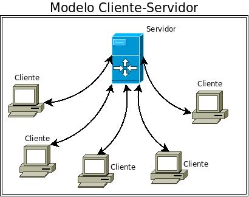

# ProyectoFIS
**Proyecto Grupo M02 de la Asignatura de Fundamentos de Ingeniería de Software de la ULL**

**Grupo de Trabajo: ROLES**
------------------------------

**> Manager o líder:** Fernando González Petit

**> Cliente:** Sonia Díaz Santos

**> Programadores:** Othmán Alexander Salah Díaz, Daniel Paz Marcos, Marta García Luis, Alejandro González González, Aitor Hernández Sánchez

### **PLAN DE TRABAJO**

Empezado el sistema de Proyecto que ofrece Github. Mucho más visual que ir retocando un fichero de texto.

Base de datos General e Histórico (History) -> Daniel

Gestión de Perfiles y Bases de Datos Propias(Profile) -> Sonia

Gestión de Control de Servidor (main/Server-Controller) -> Fernando

Gestión de Control de Cliente (main/Client-Controller) -> Marta, Othmán

Base de Datos de Cliente (Caché del modo Cliente) -> Aitor

Proceso de login (Crossplatform) -> Alejandro

### **OBJETIVO INICIAL**
----------------------

Se plantea la creación de una aplicación en C++ con el modelo cliente-servidor que funcione como una red social en un entorno "privado" o corporativo. Para ello, se seguirá el esquema de planificación realizado en la primera reunión del grupo de desarrollo.

### **MODELO BÁSICO INICIAL**

(Nótese que aunque tiene elementos de UML no es sino una versión orientativa y hecha sobre la marcha, servirá únicamente como concepto)

***1. Creación del Servidor:***
Programa en C++ que gestiona la base de datos contenedora de datos del usuario y da servicio a las peticiones de datos y uso de la aplicación que requieran consultas con la base de datos.
  
***2. Creación del Cliente:***
El cliente podrá inciar sesión o realizar el login y, además podrá acceder a su perfil. Tendrá un menú para que el usuario pueda: enviar mensajes, modificar su perfil. 

***3. Creación del Login:***
En esta clase se realizará la creación de la cuenta de usuario. Si ya tienes una cuenta creada previamente te logeas y realizas el login, si no tienes una cuenta, tienes la opción de crearte una.
Los datos de cada usuario y sus respectivas contraseñas se guardarán en una base de datos. 
Si un usuario ha introducido mal sus datos (usuario o contraseña) tres veces consecutivas, le llegará un mensaje de error.

***4. Creación del Mensaje:***
Contiene el tamaño del mensaje.

***5. Creación del Historial:***
En esta clase se guardarán los mensajes enviados en un fichero, pero solo si el usuario está logeado, es decir, si tiene una cuenta y ha accedido satisfactoriamente. 

***6. Creación del Perfil:***
Contendrá la información de las interacciones del usuario. Guardará en un fichero la información relativa a los mensajes, es decir, el usuario emisor, el usuario receptor y el mensaje enviado.
Consta de un ID (identificador) de los usuarios, tanto emisores como receptores para poder conocer la dirección real donde se localizan dichos usuarios, en nuestro caso vamos a acceder a la clase historial donde se han guardado previamente las ID's de los usuarios.
También tendremos en cuenta el orden de llegada de los mensajes.

